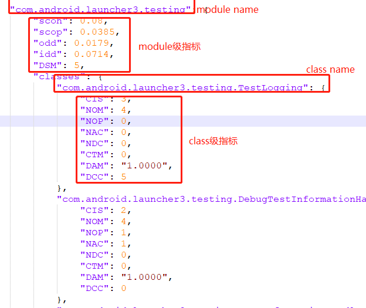

# MicroEvaluator工具介绍

## 功能

- 度量功能：根据项目功能依赖文件度量项目质量

     ```python
     python measure.py -d [dep_path]   #以package为粒度计算
     python measure.py -d [dep_path] -mp [mpmapping_path]   #以用户定义的粒度计算
     ```

+ 对度量结果进行对比

```python
python measure.py -c1 [com_path1] -c2 [com_path2]    #对两个不同版本的度量结果进行对比(以最新版本的度量结果为基准)
python measure.py -c1 [com_path1] -c2 [com_path2] -pp [ppmapping_path]    #若新版本中的package name有变动，给出变动映射
```

package name映射文件格式示例：


对diff后的结果进行分析


## 命令说明

 ```python
 usage: measure.py [-h] [-d DEP] [-mp MPMAPPING] [-pp PPMAPPING] [-c1 COM1] [-c2 COM2] [-df DIFF] [-pro PROJECT] [-out OUTPUT]
 
 -h, --help                            show this help message and exit
 -d DEP, --dep DEP                     dependency file path
 -mp MPMAPPING, --mpmapping MPMAPPING  mapping between module and packages
 -pp PPMAPPING, --ppmapping PPMAPPING  mapping between old package name and new package name
 -c1 COM1, --com1 COM1                 the measure result path of the previous version
 -c2 COM2, --com2 COM2                 the measure result path of the later version
 -df DIFF, --diff DIFF                 the folder path of diff result
 -pro PROJECT, --project PROJECT       the folder path of project
 -out OUTPUT, --output OUTPUT          the folder path of output
 ```

## 使用步骤

1 解压工具包

2 在工具包路径下运行相应命令

## 指标说明

<table>
   <tr>
      <th>指标</th>
      <th>含义</th>
      <th>粒度</th>
   </tr>
   <tr>
      <td>scoh(structural cohesion)</td>
      <td>结构内聚度</td>
      <td>module</td>
   </tr>
   <tr>
      <td>scop(structural coupling)</td>
      <td>结构耦合度</td>
      <td>module</td>
   </tr>
   <tr>
      <td>idd(in-degree dependence)</td>
      <td>被其他模块耦合程度</td>
      <td>module</td>
   </tr>
   <tr>
      <td>odd(out-degree dependence)</td>
      <td>耦合其他模块程度</td>
      <td>module</td>
   </tr>
   <tr>
      <td>DSM(design size in module)</td>
      <td>模块中类总数</td>
      <td>module</td>
   </tr>
   <tr>
      <td>DAM(Data access metrics)</td>
      <td>类中私有字段占比</td>
      <td>class</td>
   </tr>
   <tr>
      <td>CIS(Class interface size)</td>
      <td>类中公共接口数</td>
      <td>class</td>
   </tr>
   <tr>
      <td>NAC(Number of Ancestor Classes)</td>
      <td>类继承树深度</td>
      <td>class</td>
   </tr>
   <tr>
      <td>NDC(Number of Descendent Classes)</td>
      <td>派生类个数</td>
      <td>class</td>
   </tr>
   <tr>
      <td>NOP(number of polymorphic methods)</td>
      <td>多态方法数量</td>
      <td>class</td>
   </tr>
   <tr>
      <td>NOM(number of methods)</td>
      <td>类中方法总数</td>
      <td>class</td>
   </tr>
   <tr>
      <td>IDCC(intra direct class coupling)</td>
      <td>模块内耦合类数量</td>
      <td>class</td>
   </tr>
    <tr>
      <td>EDCC(external direct class coupling)</td>
      <td>模块外耦合类数量</td>
      <td>class</td>
   </tr>
   <tr>
      <td>CTM(Coupling through Message Passing)</td>
      <td>调用方法个数(除自身类中方法)</td>
      <td>class</td>
   </tr>
</table>

## 输出结果说明

1  度量功能

输出json格式度量结果，示例如下：


2  对比功能

输出json格式文件，对两个版本演化过程中每个指标的变化幅度进行统计输出，示例如下：


输出xlsx格式文件，其中包含一个演化趋势sheet页，对两个版本在演化过程中的指标变化幅度进行归一化处理，并根据演化的趋势进行指示(越绿代表演化状态越好，越红代表演化状态越差)，示例如下：

