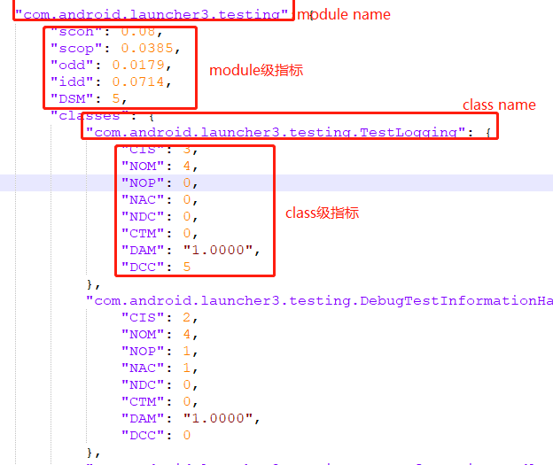
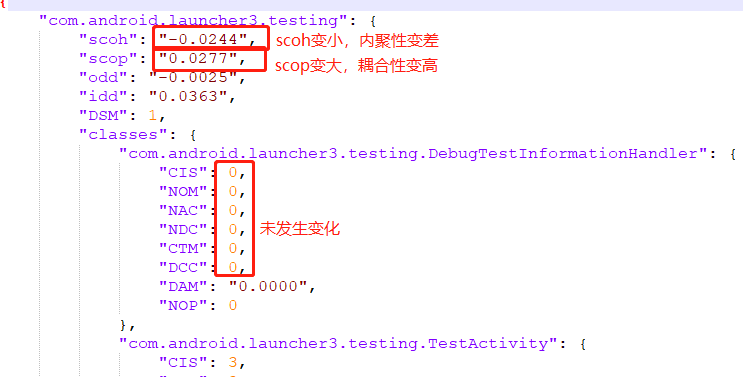
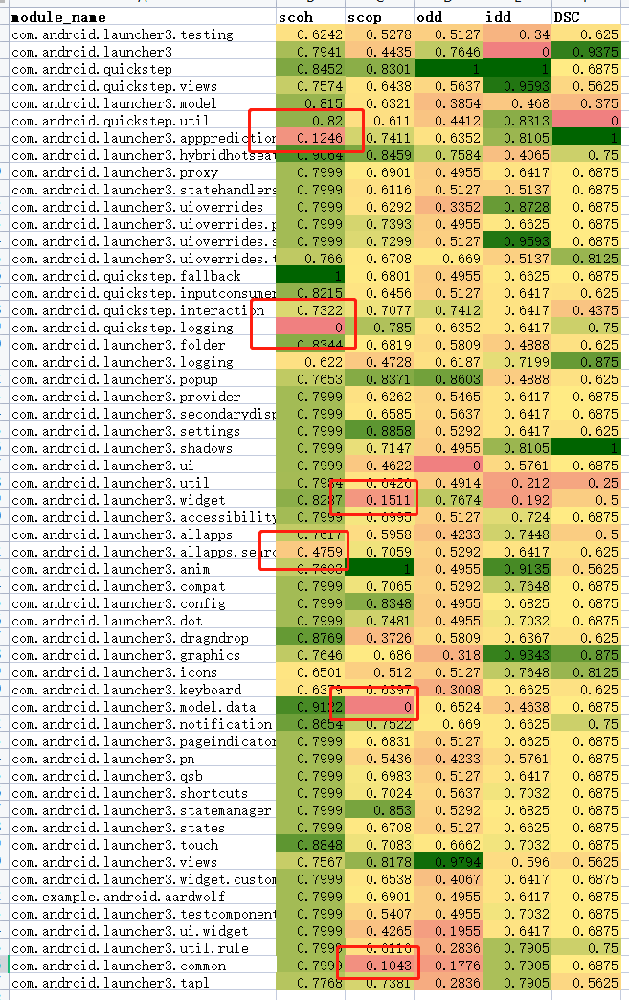

# Evaluator工具介绍

## 功能

- **单版本度量功能：根据项目功能依赖文件度量项目质量**

     ```python
     python measure.py -opt sv -obj [object] -pro [project_path] -ver [version] <-dep [dep_path]> -out [out_path]
     ```

+ **多版本度量功能：根据多版本依赖结果度量每个项目质量，并给出项目生长曲线图**

  ```python
  python measure.py -opt mv -obj [object] -pro [project_path] -ver [version] <-dep [dep_path]> -out [out_path]
  ```

+ **对度量结果进行对比：根据两个版本度量结果对比，给出模块质量腐化热点图(diff_result.xlsx)**

  ```
  python measure.py -opt com -p1 [old_path] -p2 [new_path] -out [out_path]
  ```

- **定位可维护性问题根因：定位架构在演化过程中发生可维护性问题的根因**。

  **本功能可应用于两种场景：一般场景(横向演化过程中质量腐化根因识别)和安卓扩展场景(伴生项目扩展原生项目的纵向演化过程中质量腐化根因识别)**
  
  ```
  场景一：python measure.py -opt det -obj others -diff [diff_path] -out [out_path]
  场景二：python measure.py -opt det -obj extension -p1 [native_project_measure_path] -p1 [extensive_project_measure_path] -out [out_path]
  ```

## 命令说明

 ```python
 usage: measure.py [-h] [-opt OPT] [-obj OBJ] [-ver VER] [-pro PRO] [-dep DEP] [-p1 P1] [-p2 P2] [-diff DIFF] [-out OUT]
     
   -h, --help  show this help message and exit
   -opt OPT    必选参数，功能选项，提供sv/mv/com/det四种选择
   -obj OBJ    处理对象，目前提供extension/others两种场景(除com功能，其他功能下此选项为必选参数)
   -ver VER    处理版本，若为单版本度量不存在版本号请输入main作为版本号，若为多版本使用?连接不同版本号
   -pro PRO    项目路径(除com/det功能，其他功能下此选项为必选参数)
   -dep DEP    可选参数，依赖文件路径，若输入应遵循示例所示格式，若不输入工具会自动生成依赖文件到out_path
   -p1 P1      对比功能较老版本度量结果路径，路径下需包含measure_result.json和dep.json
   -p2 P2      对比功能较新版本度量结果路径，路径下需包含measure_result.json和dep.json
   -diff DIFF  定位功能输入路径，路径包含measure_diff.json和dep_diff.json
   -out OUT    必选参数，结果输出文件夹
 ```

##### **dep_path示例如下：**


## 使用方法

1. 直接使用

   使用`python measure.py -opt...`使用

2. 打包为可执行文件使用

   ```
   pip install Pyinstaller
   Pyinstaller -F measure.py -p 项目路径
   ```

   打包完成后在dist目录下执行`measure.exe -opt ...`使用（注意：不要挪动dist下jar包位置）

## 指标说明

本度量工具共提供4个粒度的项目可维护性度量，每个粒度提供的指标数量统计如下：

| 粒度    | Java已支持指标数量 | C已支持指标数量 |
| ------- | ------------------ | --------------- |
| project | 11                 | 4              |
| module  | 12                 | 7              |
| class   | 42                 | 11              |
| method  | 12               | 11              |

file在计算耦合和内聚程度时，依赖于struct之间的依赖关系，目前struct之间只存在embed关系，需将function考虑进来，但需确认：file内的实体个数认定为struct和function之和？<一等公民：变量/方法/结构体...>  两种关系

- ### project 

| 指标                              | Java中定义                                                   | c中定义 | c支持状态 |
| --------------------------------- | ------------------------------------------------------------ | ------- | --------- |
| score                             | 对模块级指标进行融合得到模块可维护性的综合评分               | -       | 已支持    |
| SMQ(structural modularity)        | 结构模块化程度。SMQ 值越大,说明模块的模块化程度越高。        | 同java  | 已支持    |
| ODD(out-degree dependence)        | ODD越大，总体耦合其他模块的程度越高，模块之间的动态交互度越高。 | 同java  | 已支持    |
| IDD(in-degree dependence)         | IDD越大，总体被耦合的程度越高，模块间的动态交互程度越高。    | 同java  | 已支持    |
| CHM                               | 项目中所有模块在消息层内聚程度的均值。                       | 同java  | 待支持    |
| CHD                               | 项目中所有模块在领域层内聚程度的均值。                       | 同java  | 待支持    |
| SPREAD                            | 度量模块中的实体在演化过程中横切协同变化集群的个数。SPREAD越小，总体模块性越好。（粒度太细，目前历史提取无法做到此粒度） | -       | 待支持    |
| FOCUS                             | 度量模块化良好的程度。FOCUS越大，总体模块性越好。            | -       | 待支持    |
| ICF(intra co-change frequency)    | 所有模块演化内部共变频率的平均值。ICF越高，总体模块内的实体更有可能一起演化。 | -       | 待支持    |
| ECF(external co-change frequency) | 所有模块演化外部共变频率的平均值。ECF越低，总体跨模块边界的实体更有可能独立演化。 | -       | 待支持    |
| REI(ratio of ecf to icf)          | 所有模块演化外部共变频率与内部共变频率的比值的平均值。REI越低，说明总体不同模块一起修改的可能性越低，各模块更有可能会独立演化、独立维护。 | -       | 待支持    |

- ### module --**file**

| 指标   | java中定义                                                   | c中定义                 | c支持状态 |
| ------ | ------------------------------------------------------------ | ----------------------- | --------- |
| scoh   | scoh越大，模块内的结构内聚程度越大。                         | 同java(struct/function) | 已支持    |
| scop   | scop越大，模块间的结构耦合程度越大。                         | 同java(struct/function) | 已支持    |
| odd    | odd越大，该模块耦合其他模块的程度越高，模块之间的动态交互度越高。 | 同java(struct/function) | 已支持    |
| idd    | idd越大，该模块被耦合的程度越高，模块间的动态交互程度越高。  | 同java(struct/function) | 已支持    |
| DSM    | DSM越大，模块越复杂，与外部耦合的可能性越高                  | 同java(struct+function) | 已支持    |
| NOI    | -                                                            | file导入依赖的个数      | 已支持    |
| NOID   | -                                                            | file被导入依赖的个数    | 已支持    |
| chm    | chm越大，模块在消息层内聚程度越高。                          | -                       | 待支持    |
| chd    | chd越大，模块在领域层内聚程度越高。                          | -                       | 待支持    |
| spread | 度量模块中的实体在演化过程中接触的共变集群个数。spread越小，模块性越好。 | -                       | 待支持    |
| focus  | 度量模块中的实体在演化过程中专注自身演进的程度。focus越大，模块性越好。 | -                       | 待支持    |
| icf    | icf越高，模块内的实体更有可能一起演化。                      | -                       | 待支持    |
| ecf    | ecf越低，跨模块边界的实体更有可能独立演化。                  | -                       | 待支持    |
| rei    | rei越低，说明不同模块一起修改的可能性越低，模块更有可能会独立演化、独立维护。 | -                       | 待支持    |

- ### class --struct

| 指标                   | java中定义                                  | c中定义                                     | c支持状态 |
| ---------------------- | ------------------------------------------- | ------------------------------------------- | --------- |
| CBC                    | 类依赖的数量(包含被依赖)                    | 同java(struct之间的embed关系)               | 已支持    |
| c_FAN_IN               | 类扇入                                      | 同java                                      | 已支持    |
| c_FAN_OUT              | 类扇出                                      | 同java                                      | 已支持    |
| IDCC                   | 模块内耦合类数量                            | 同java                                      | 已支持    |
| IODD                   | 模块内耦合其他类的数量                      | 同java                                      | 已支持    |
| IIDD                   | 模块内被其他类耦合的数量                    | 同java                                      | 已支持    |
| EDCC                   | 模块外耦合类数量                            | 同java                                      | 已支持    |
| NAC                    | 类继承树深度                                | 同java                                      | 已支持    |
| NDC                    | 派生类个数                                  | 同java                                      | 已支持    |
| NOM                    | 类中方法总数                                | -(统计下function pointer数量)               | 已支持    |
| WMC                    | 类方法复杂度之和                            | -                                           | 已支持    |
| c_chm                  | 类在消息层的功能内聚度                      | -(考虑要把function的参数都抽出来之后再进行) | 待支持    |
| c_chd                  | 类在领域层的功能内聚度                      | -                                           | 待支持    |
| NOVM                   | 可见方法数量                                | -                                           | 待支持    |
| CTM                    | 调用方法个数(除自身类中方法)                | -                                           | 待支持    |
| RFC                    | 类的响应数量(本地方法数量+调用外部方法数量) | -                                           | 待支持    |
| NOSI                   | 静态方法调用数量                            | -                                           | 待支持    |
| TCC                    | 紧类内聚(仅考虑可见方法的直接调用)          | -                                           | 待支持    |
| LCC                    | 松类内聚(考虑可见方法的直接调用和间接调用)  | -                                           | 待支持    |
| LCOM                   | 方法内聚性缺失                              | -                                           | 待支持    |
| LOCM*                  | 方法内聚性缺失(归一化结果)                  | -                                           | 待支持    |
| c_modifiers            | 类中修饰符                                  | -                                           | 待支持    |
| CIS                    | 类中公共接口数                              | -(visibility）                              | 待支持    |
| privateMethodsQty      | 私有方法数量                                | -                                           | 待支持    |
| protectedMethodsQty    | 保护方法数量                                | -                                           | 待支持    |
| staticMethodsQty       | 静态方法数量                                | -(storage_class)                            | 待支持    |
| c_variablesQty         | 类中变量数量                                | -                                           | 待支持    |
| NOF                    | 字段数量                                    | -                                           | 待支持    |
| staticFieldsQty        | 静态字段数量                                | -(storage_class)                            | 待支持    |
| protectedFieldsQty     | 保护字段数量                                | -                                           | 待支持    |
| privateFieldsQty       | 私有字段数量                                | -                                           | 待支持    |
| publicFieldsQty        | 公有字段数量                                | -                                           | 待支持    |
| defaultMethodsQty      | 缺省方法数量                                | -                                           | 不支持    |
| abstractMethodsQty     | 抽象方法数量                                | -                                           | 不支持    |
| finalMethodsQty        | final方法数量                               | -                                           | 不支持    |
| synchronizedMethodsQty | synchronized方法数量                        | -                                           | 不支持    |
| defaultFieldsQty       | 缺省字段数量                                | -                                           | 不支持    |
| finalFieldsQty         | final字段数量                               | -                                           | 不支持    |
| synchronizedFieldsQty  | synchronized字段数量                        | -                                           | 不支持    |
| NOP                    | 多态方法数量                                | -                                           | 不支持    |
| NOI                    | 导入数量                                    | -                                           | 不支持    |
| NOID                   | 被导入数量                                  | -                                           | 不支持    |

- ### method  --function

| 指标                           | java中定义                       | c中定义                                                      | c支持状态 |
| ------------------------------ | -------------------------------- | ------------------------------------------------------------ | --------- |
| startLine                      | 方法开始位置                     | 同java                                                       | 已支持    |
| CBM                            | 方法依赖的数量                   | ①**relation-typeuse**:<br />function->struct<br />②**relation-call**:<br />function->function<br />③relation-parameter:<br />a)parameter->type(function pointer)<br />b)parameter->type(typedef)->typedef(function pointer)<br />④relation-use:<br />var->function(parent) | 部分支持  |
| m_FAN_IN                       | 方法扇入                         | 同java(被耦合数量) --call                                    | 已支持    |
| m_FAN_OUT                      | 方法扇出                         | 同java(耦合数量)--typeuse和call                              | 已支持    |
| IDMC                           | 模块内(所有file)耦合方法的数量   | 同java(耦合的方法数量)                                       | 已支持    |
| EDMC                           | 模块外耦合方法的数量             | 同java(耦合的方法数量)                                       | 已支持    |
| methodsInvokedQty              | 调用方法的数量                   | 同java                                                       | 已支持    |
| methodsInvokedLocalQty         | 调用本地方法(当前文件)的数量     | 同java                                                       | 已支持    |
| methodsInvokedIndirectLocalQty | 间接调用本地方法(当前文件)的数量 | 同java                                                       | 已支持    |
| m_variablesQty                 | 方法中变量数量                   | 同java                                                       | 已支持    |
| parametersQty                  | 方法参数数量                     | 同java                                                       | 已支持    |
| m_modifier                     | 方法修饰符                       | -(visibility(public/private/protected))                      | 待支持    |
| storage_class                  | 方法存储区                       | -(storage_class(extern/auto/const...))                       | 待支持    |

## 输出结果说明

1  度量功能

输出json格式度量结果，示例如下：


2  对比功能

输出json格式文件，对两个版本演化过程中每个指标的变化幅度进行统计输出，示例如下：


输出xlsx格式文件，其中包含一个演化趋势sheet页，对两个版本在演化过程中的指标变化幅度进行归一化处理，并根据演化的趋势进行指示(越绿代表演化状态越好，越红代表演化状态越差)，示例如下：
 

## 参考文献

[1] C. Zhong, S. Li, H. Zhang, and C. Zhang, “Evaluating granularity of microservices-oriented system based on bounded context,” Journal of Software, vol. 30, no. 10, pp. 3227–3241, 2019.

[2] W. Jin, D. Zhong, Y. Zhang, M. Yang, and T. Liu, “Microservice maintainability measurement based on multi-sourced feature space,”Journal of Software, vol. 32, no. 5, pp. 1322–1340, 2021.

[3] L. L. Silva, M. T. Valente, and M. d. A. Maia, “Assessing modularity using co-change clusters,” in Proceedings of the 13th international conference on Modularity, pp. 49–60, 2014.

[4] J. Bansiya and C. G. Davis, “A hierarchical model for object-oriented design quality assessment,” IEEE Transactions on software engineering,vol. 28, no. 1, pp. 4–17, 2002.

[5] S. R. Chidamber and C. F. Kemerer, “A metrics suite for object oriented design,” IEEE Transactions on software engineering, vol. 20, no. 6, pp. 476–493, 1994.
