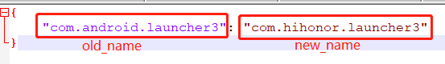
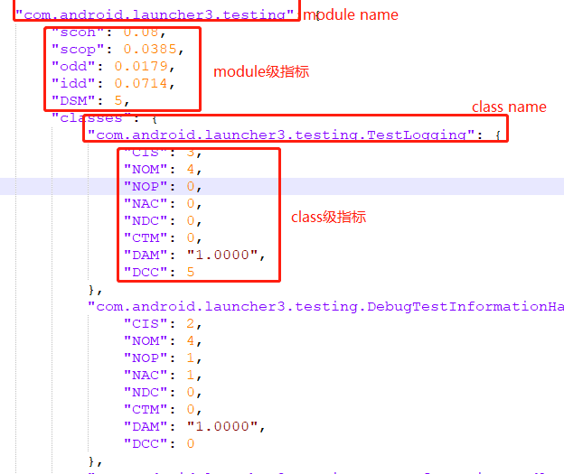
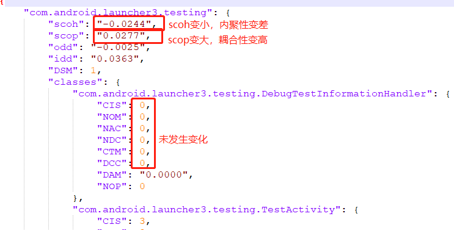
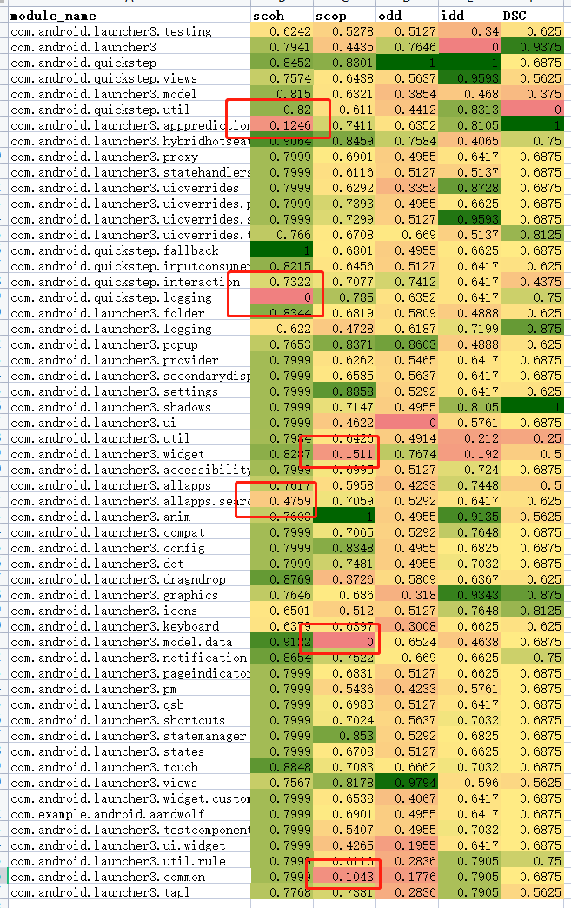

# MicroEvaluator工具介绍

## 功能

- ***单版本度量功能：根据项目功能依赖文件度量项目质量***

     ```python
     python measure.py -opt sv -pro [project_path] -ver [version] -dep [dep_path] -out [out_path]  #以package为粒度计算，version为当前需要度量的版本号，dep_path为只存在依赖文件的文件夹路径
     python measure.py -opt sv -pro [project_path] -ver [version] -dep [dep_path] -mp [mpmapping_path] -out [out_path]   #以用户定义的粒度计算
     ```

+ ***多版本度量功能：根据多版本依赖结果度量每个项目质量，并给出项目整体质量变化趋势图***

  ```python
  python measure.py -opt mv -pro [project_path] -ver [version] -dep [dep_path] -out [out_path]   #以package为粒度计算，dep_path为只存在依赖文件的文件夹路径；如有多个项目、版本或dep路径，使用?分隔连接
  ```

+ ***对度量结果进行对比***

```python
python measure.py -opt com -c1 [old_path] -c2 [new_path] -out [out_path]    #对两个不同版本的度量结果进行对比(以最新版本的度量结果为基准)，old_path为旧版本度量生成的包含dep.json和measure_result.json的结果路径，new_path为新版本度量生成的包含dep.json和measure_result.json的结果路径
python measure.py -opt com -c1 [old_path] -c2 [new_path] -pp [ppmapping_path]  -out [out_path]   #若新版本中的package name有变动，给出变动映射
```

  package name映射文件格式示例：



## 命令说明

 ```python
 usage: measure.py [-h] [-opt OPT] [-pro PRO] [-dep DEP] [-mp MP] [-pp PP] [-c1 C1] [-c2 C2] [-diff DIFF] [-out OUT]
     
   -h, --help  show this help message and exit
   -opt OPT    function options
   -pro PRO    project path
   -dep DEP    dependency file path
   -mp MP      mapping between module and packages
   -pp PP      mapping between old package name and new package name
   -c1 C1      the measure result path of the previous version
   -c2 C2      the measure result path of the later version
   -diff DIFF  the folder path of diff result
   -out OUT    the folder path of output
 ```

## 使用步骤

1 解压工具包

2 在工具包路径下运行相应命令

## 指标说明

本度量工具共提供4个粒度的项目可维护性度量，每个粒度提供的指标数量统计如下：

| 粒度    | 指标数量 |
| ------- | -------- |
| project | 8        |
| module  | 10       |
| class   | 42       |
| method  | 14       |

- **project**

  | 指标                              | 说明                                                         |
  | :-------------------------------- | ------------------------------------------------------------ |
  | SMQ(structural modularity)        | 结构模块化程度。SMQ 值越大,说明模块的模块化程度越高。        |
  | SPREAD                            | 度量模块中的实体在演化过程中横切协同变化集群的个数。SPREAD越小，总体模块性越好。 |
  | FOCUS                             | 度量模块化良好的程度。FOCUS越大，总体模块性越好。            |
  | ICF(intra co-change frequency)    | 所有模块演化内部共变频率的平均值。ICF越高，总体模块内的实体更有可能一起演化。 |
  | ECF(external co-change frequency) | 所有模块演化外部共变频率的平均值。ECF越低，总体跨模块边界的实体更有可能独立演化。 |
  | REI(ratio of ecf to icf)          | 所有模块演化外部共变频率与内部共变频率的比值的平均值。REI越低，说明总体不同模块一起修改的可能性越低，各模块更有可能会独立演化、独立维护。 |
  | ODD(out-degree dependence)        | ODD越大，总体耦合其他模块的程度越高，模块之间的动态交互度越高。 |
  | IDD(in-degree dependence)         | IDD越大，总体被耦合的程度越高，模块间的动态交互程度越高。    |

- **module**

  | 指标   | 说明                                                         |
  | ------ | ------------------------------------------------------------ |
  | scoh   | scoh越大，模块内的结构内聚程度越大。                         |
  | scop   | scop越大，模块间的结构耦合程度越大。                         |
  | odd    | odd越大，该模块耦合其他模块的程度越高，模块之间的动态交互度越高。 |
  | idd    | idd越大，该模块被耦合的程度越高，模块间的动态交互程度越高。  |
  | spread | 度量模块中的实体在演化过程中接触的共变集群个数。spread越小，模块性越好。 |
  | focus  | 度量模块中的实体在演化过程中专注自身演进的程度。focus越大，模块性越好。 |
  | icf    | icf越高，模块内的实体更有可能一起演化。                      |
  | ecf    | ecf越低，跨模块边界的实体更有可能独立演化。                  |
  | rei    | rei越低，说明不同模块一起修改的可能性越低，模块更有可能会独立演化、独立维护。 |
  | DSM    | DSM越大，模块越复杂，与外部耦合的可能性越高。                |

- **class**

  | 指标                   | 说明                                        |
  | ---------------------- | ------------------------------------------- |
  | CIS                    | 类中公共接口数                              |
  | NOM                    | 类中方法总数                                |
  | NOP                    | 多态方法数量                                |
  | NAC                    | 类继承树深度                                |
  | NDC                    | 派生类个数                                  |
  | NOI                    | 类导入依赖的个数                            |
  | NOID                   | 类被导入依赖的个数                          |
  | CTM                    | 调用方法个数(除自身类中方法)                |
  | IDCC                   | 模块内耦合类数量                            |
  | IODD                   | 模块内耦合其他类的数量                      |
  | IIDD                   | 模块内被其他类耦合的数量                    |
  | EDCC                   | 模块外耦合类数量                            |
  | c_FAN_IN               | 类扇入                                      |
  | c_FAN_OUT              | 类扇出                                      |
  | CBC                    | 类依赖的数量(包含被依赖)                    |
  | c_chm                  | 类在消息层的功能内聚度                      |
  | c_chd                  | 类在领域层的功能内聚度                      |
  | c_variablesQty         | 类中变量数量                                |
  | privateMethodsQty      | 私有方法数量                                |
  | protectedMethodsQty    | 保护方法数量                                |
  | staticMethodsQty       | 静态方法数量                                |
  | defaultMethodsQty      | 缺省方法数量                                |
  | abstractMethodsQty     | 抽象方法数量                                |
  | finalMethodsQty        | final方法数量                               |
  | synchronizedMethodsQty | synchronized方法数量                        |
  | publicFieldsQty        | 公有字段数量                                |
  | privateFieldsQty       | 私有字段数量                                |
  | protectedFieldsQty     | 保护字段数量                                |
  | staticFieldsQty        | 静态字段数量                                |
  | defaultFieldsQty       | 缺省字段数量                                |
  | finalFieldsQty         | final字段数量                               |
  | synchronizedFieldsQty  | synchronized字段数量                        |
  | RFC                    | 类的响应数量(本地方法数量+调用外部方法数量) |
  | NOF                    | 字段数量                                    |
  | NOVM                   | 可见方法数量                                |
  | NOSI                   | 静态方法调用数量                            |
  | TCC                    | 紧类内聚(仅考虑可见方法的直接调用)          |
  | LCC                    | 松类内聚(考虑可见方法的直接调用和间接调用)  |
  | LCOM                   | 方法内聚性缺失                              |
  | LOCM*                  | 方法内聚性缺失(标准化结果)                  |
  | WMC                    | 类方法复杂度之和                            |
  | c_modifiers            | 类中修饰符                                  |

- **method**

  | 指标                           | 说明                           |
  | ------------------------------ | ------------------------------ |
  | startLine                      | 方法开始位置                   |
  | CBM                            | 方法依赖的数量(call/override)  |
  | m_FAN_IN                       | 方法扇入                       |
  | m_FAN_OUT                      | 方法扇出                       |
  | IDMC                           | 模块内耦合方法的数量           |
  | EDMC                           | 模块外耦合方法的数量           |
  | IsOverride                     | 是否是override方法(true/false) |
  | OverridedQty                   | 被override的类个数             |
  | methodsInvokedQty              | 调用方法的数量                 |
  | methodsInvokedLocalQty         | 调用本地方法的数量             |
  | methodsInvokedIndirectLocalQty | 间接调用本地方法的数量         |
  | m_variablesQty                 | 方法中变量数量                 |
  | parametersQty                  | 方法参数数量                   |
  | m_modifier                     | 方法修饰符                     |


## 输出结果说明

1  度量功能

输出json格式度量结果，示例如下：


2  对比功能

输出json格式文件，对两个版本演化过程中每个指标的变化幅度进行统计输出，示例如下：


输出xlsx格式文件，其中包含一个演化趋势sheet页，对两个版本在演化过程中的指标变化幅度进行归一化处理，并根据演化的趋势进行指示(越绿代表演化状态越好，越红代表演化状态越差)，示例如下：


## 打包为可执行文件
  ```python
  pip install Pyinstaller
  Pyinstaller -F measure.py -p 项目路径 
  ```
